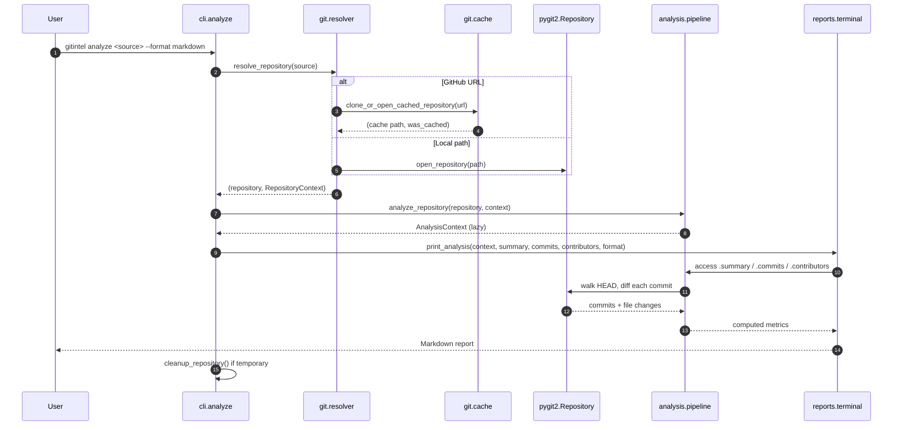
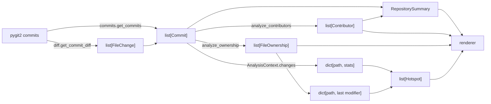

# Data flow

How a repository argument becomes a rendered report, step by step.

## End-to-end sequence

## Data transformations

### 1. Commits

`get_commits()` walks from `repository.head.target` with `GIT_SORT_TIME` (newest first). For
each commit it records hash, author name, author email, stripped message, commit timestamp, and
the file changes returned by `get_commit_diff()`.

### 2. File changes

`get_commit_diff()`:

- **Commit with parents** — diff `parent[0].tree` against `commit.tree`, call `find_similar()`
  to detect renames, and record `patch.line_stats[1]`/`[2]` as additions/deletions under
  `delta.new_file.path`.
- **Initial commit** — recursively walk the tree; each blob becomes a `FileChange` whose
  additions equal the number of newlines in the decoded content.

### 3. Aggregations

| Output | Grouping key | Values |
| --- | --- | --- |
| `contributors` | author email | commits, distinct files, additions, deletions |
| `ownership` | file path → author name | modifications, lines changed, last modifier/timestamp |
| `changes` | file path | modifications, lines changed, distinct contributor count |
| `summary` | — | commit count, contributor count, distinct file count |

### 4. Scoring

`calculate_hotspots(commits, changes, ownership_map)` applies the threshold rules described in
[Metrics and scoring](../concepts/metrics.md#hotspot-risk-score), caps scores at 100, drops
zero-score files, and sorts descending.

### 5. Rendering

The command passes the computed values to a `print_*` dispatcher, which selects a renderer
based on the lowercased `--format` value and writes to a Rich `Console`.

## Control flow details

- **Progress** — `run_with_progress()` wraps the resolve and analyze calls with a spinner unless
  `--quiet` was passed.
- **Error handling** — every command catches `ValueError`, prints a red panel through
  `handle_error()`, and exits with code `1`.
- **Cleanup** — the `finally` block calls `cleanup_repository(context.path)` when
  `context.temporary` is true; the function itself refuses to delete anything whose directory
  name does not start with `gitintel_`.

## What crosses process boundaries

Nothing. There is no daemon, no subprocess (not even `git`), no database, and no network call
beyond the optional clone. Reports are written to stdout.
