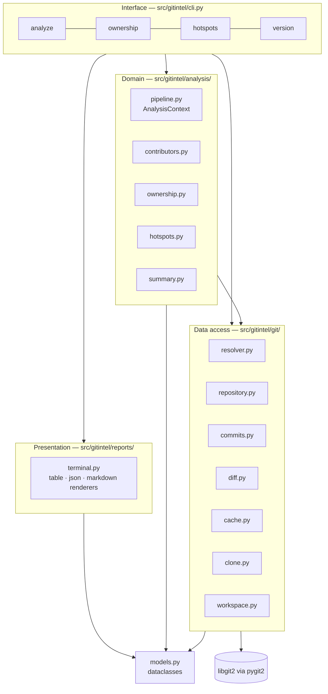

# Architecture overview

GitIntel is a four-layer Python package. Each layer depends only on the layers below it.

## Layers

| Layer | Package | Responsibility | Depends on |
| --- | --- | --- | --- |
| Interface | `gitintel.cli` | Argument parsing, error handling, orchestration, cleanup | everything |
| Presentation | `gitintel.reports` | Turning models into tables, JSON, and Markdown | `models` |
| Domain | `gitintel.analysis` | Metrics: contributors, summary, ownership, hotspots | `git`, `models` |
| Data access | `gitintel.git` | Opening, cloning, caching, walking, diffing | `pygit2`, `models` |
| Contracts | `gitintel.models` | Dataclasses shared by every layer | — |

The dependency rule is one-directional: `analysis` never imports `reports`, and `git` never
imports `analysis`. That is what keeps the metric functions pure and unit-testable without a
repository on disk.

## Runtime dependencies

| Dependency | Role |
| --- | --- |
| [`pygit2`](https://www.pygit2.org/) | libgit2 bindings: open, clone, walk, diff — no `git` subprocess is ever spawned |
| [`typer`](https://typer.tiangolo.com/) | CLI definition, help text, shell completion |
| [`rich`](https://rich.readthedocs.io/) | Tables, panels, progress spinners, clone progress bar |
| [`pydantic`](https://docs.pydantic.dev/) | Declared dependency; the current models use plain dataclasses |

## Execution model

- **Single process, single pass.** One commit walk per invocation, memoized in
  `AnalysisContext`. See [Analysis pipeline](../concepts/analysis-pipeline.md).
- **In-memory.** The commit list, per-file change map, and derived metrics all live in RAM for
  the lifetime of the command; nothing is persisted except the clone cache.
- **No configuration.** No config file is read, and the only environment variables consulted
  are `XDG_CACHE_HOME` (cache root) plus the ones Rich itself honours.
- **No network** unless the source is a GitHub URL that is not already cached.

## Read next

- [Components](components.md) — what each module does, file by file.
- [Data flow](data-flow.md) — how a path becomes a rendered report.
- [Design decisions](design-decisions.md) — why it is built this way, with trade-offs.
