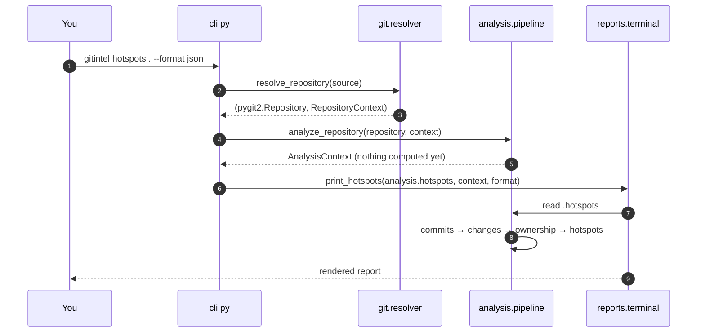
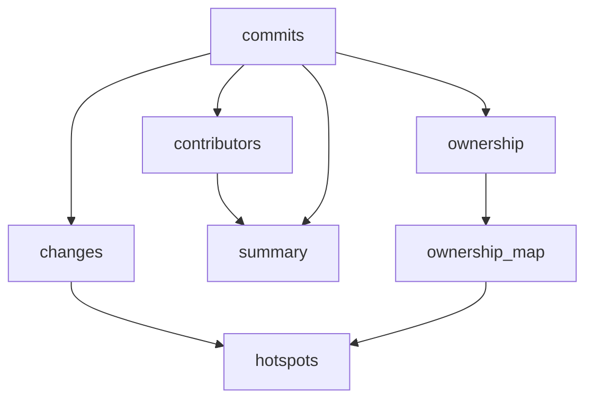

# Analysis pipeline

Every GitIntel command follows the same three phases: **resolve → analyze → render**.



## Phase 1 — Resolve

`resolve_repository(source)` decides how to obtain a repository:

- **Remote** (`https://github.com/...` or `http://github.com/...`): the URL is normalized to
  end in `.git`, then cloned into the cache — or reused if already cached — and opened.
- **Local** (anything else): the path is opened directly with `pygit2.Repository`. A path that
  is not a Git repository raises `ValueError: Invalid Git repository: <path>`.

Metadata is then extracted into a `RepositoryContext`: branch shorthand from `HEAD`, remote URL
from `origin` (or the first remote), owner and repository name parsed out of the remote path,
and `source_type` set to `GitHub` when the remote host is github.com.

Details: [Repository sources and cache](repository-sources.md).

## Phase 2 — Analyze (lazily)

`analyze_repository()` returns an `AnalysisContext`. Creating it does **no** work: every metric
is a cached property computed on first access.

| Property | Depends on | Produces |
| --- | --- | --- |
| `commits` | repository | `list[Commit]` walked from `HEAD` in time order, each with its file changes |
| `contributors` | `commits` | `list[Contributor]` sorted by commit count |
| `summary` | `commits`, `contributors` | `RepositorySummary` (commits, contributors, distinct files) |
| `ownership` | `commits` | `list[FileOwnership]` per file |
| `changes` | `commits` | per-file `{modifications, lines_changed, contributors}` |
| `ownership_map` | `ownership` | `{file path: last modifier}` |
| `hotspots` | `commits`, `changes`, `ownership_map` | `list[Hotspot]` sorted by risk score |



Because the properties memoize, `gitintel analyze` walks history once even though the summary,
contributor table, file-activity table, and health table all need the commit list.

### Cost model

The commit walk is the expensive step: for each commit, libgit2 computes a diff against the
first parent. Runtime therefore scales with *commits × files changed per commit*, not with the
size of the working tree. Repositories with tens of thousands of commits take noticeably longer;
see [Best practices](../guide/best-practices.md#large-repositories).

### Merge commits and the initial commit

- A merge commit is diffed against its **first parent only**, so changes that arrive through
  a merge are attributed to the commits on the merged branch, not to the merge itself.
- The **initial commit** has no parent. GitIntel walks its tree and records every blob as an
  addition of the number of newlines it contains. Binary files therefore contribute a
  meaningless "line" count in that one commit.

## Phase 3 — Render

The command hands the computed values to a `print_*` function in `reports/terminal.py`, which
dispatches on `--format`:

```text
print_analysis  → print_analysis_json | print_analysis_markdown | print_analysis_table
print_ownership → print_ownership_json | print_ownership_markdown | print_ownership_table
print_hotspots  → print_hotspots_json | print_hotspots_markdown | print_hotspots_table
```

All three formats are written to stdout through a Rich `Console`. Progress spinners are written
by `run_with_progress()` and can be disabled with the global `--quiet` flag.

## Cleanup

After rendering, commands remove the analyzed checkout **only** if the context is marked
temporary *and* the directory name starts with `gitintel_`. Cached clones of GitHub URLs live
in a stable cache directory and are intentionally preserved between runs.
