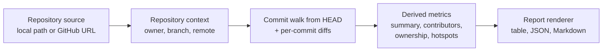

# Core concepts

GitIntel has a small conceptual model. Four ideas explain every number it prints.

1. **A source resolves to a repository context.** A local path is opened in place; a GitHub URL
   is cloned into a cache. Either way GitIntel ends up with an open repository plus metadata.
   → [Repository sources and cache](repository-sources.md)

2. **History is walked exactly once.** Commits reachable from `HEAD` are read in time order and
   each commit is diffed against its first parent to produce per-file additions and deletions.
   → [Analysis pipeline](analysis-pipeline.md)

3. **Every metric is derived from that same commit list.** Contributors, ownership, file
   activity, and hotspot risk are pure functions over commits and their file changes — the
   results are cached in memory so nothing is recomputed.
   → [Metrics and scoring](metrics.md)

4. **Reports are a presentation layer.** The analysis does not know whether it will be
   rendered as a Rich table, JSON, or Markdown.
   → [Output formats](../guide/output-formats.md)

## Read these in order

| Page | What you learn |
| --- | --- |
| [Terminology](terminology.md) | Precise definitions of contributor, owner, churn, hotspot, and more |
| [Analysis pipeline](analysis-pipeline.md) | How a command turns a path into a report, and what is lazy or cached |
| [Metrics and scoring](metrics.md) | Exact formulas and thresholds behind every number |
| [Repository sources and cache](repository-sources.md) | Local vs. remote handling, cache location, cleanup rules |

If you would rather see the code-level view, the same material is described from the
implementation side in [Architecture](../architecture/index.md).
