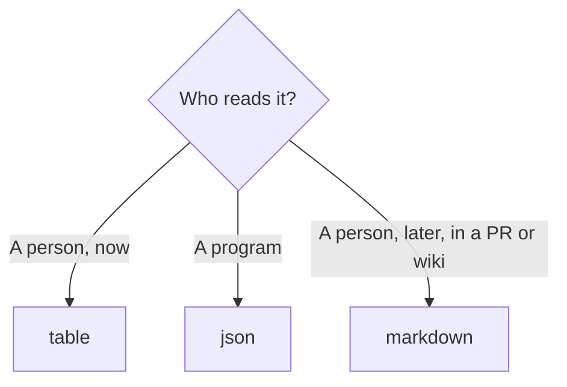

# Output formats

Every command takes `--format` (`-f`) with one of three values. The analysis is identical; only
the renderer changes.

| Value | Audience | Notes |
| --- | --- | --- |
| `table` (default) | humans in a terminal | Rich tables, colors, truncated long paths |
| `json` | scripts, dashboards, diffing | Full precision, no truncation |
| `markdown` | pull requests, wikis, docs | GitHub-flavoured tables |

The value is case-insensitive (`--format JSON` works). **An unrecognized value silently falls
back to `table`** — there is no error, so check spelling if you get tables where you expected
JSON.

## table

```bash
gitintel analyze .
```

- Renders panels and tables through Rich, sized to your terminal width.
- Long file paths are truncated with an ellipsis.
- `analyze` prints the *Most Changed Files* and *Repository Health* tables as separate tables
  after the summary.
- Status cells use color: green `[OK]`, yellow `[!!]`, red `HIGH`.

## json

```bash
gitintel --quiet analyze . --format json
```

- One JSON document per run, pretty-printed with a 2-space indent.
- Top-level keys differ per command; all three include a `repository` object. The full schema
  is in [JSON output schema](../reference/json-schema.md).
- Percentages are unrounded floats (`83.33333333333334`).
- `null` appears where a value is genuinely unknown (for example `last_commit` in an empty
  history, or `owner` for an unowned hotspot).

### Piping JSON safely

Output is written through a Rich console, which soft-wraps lines at the detected terminal
width. When output is not a terminal Rich assumes 80 columns, so long strings such as absolute
paths and remote URLs may be wrapped onto their own line. Whitespace between JSON tokens is
insignificant, so parsers still accept the document — but if you want byte-stable output, pin
the width:

```bash
COLUMNS=200 gitintel --quiet analyze . --format json > analysis.json
```

Always add the global `--quiet` flag when redirecting: it suppresses the progress spinners that
otherwise interleave with the report.

```bash
gitintel --quiet hotspots . --format json | jq '.hotspots | length'
```

## markdown

```bash
gitintel --quiet analyze . --format markdown > report.md
```

- Emits `#`/`##` headings and pipe tables, ready to paste into an issue, PR comment, or wiki.
- The same sections as the table renderer, minus colors.
- Status values are plain text (`OK`, `WARN`, `HIGH`, `MED`).

Example fragment:

```markdown
## Summary
- Commits: 6
- Contributors: 2
- Files Changed: 44
- Last Commit: 2026-08-15 14:10

## Top Contributors
| Contributor | Commits | Files | Share |
|---|---|---|---|
| Boussaden Taha | 5 | 6 | 83.3% |
```

Same width caveat as JSON: use `COLUMNS=200` if a long path wraps inside a table cell.

## Choosing a format



## Quick reference

```bash
gitintel analyze .                                   # table
gitintel --quiet analyze . -f json | jq .summary     # json
gitintel --quiet ownership . -f markdown >> REPORT.md
COLUMNS=200 gitintel --quiet hotspots . -f json > hotspots.json
```
